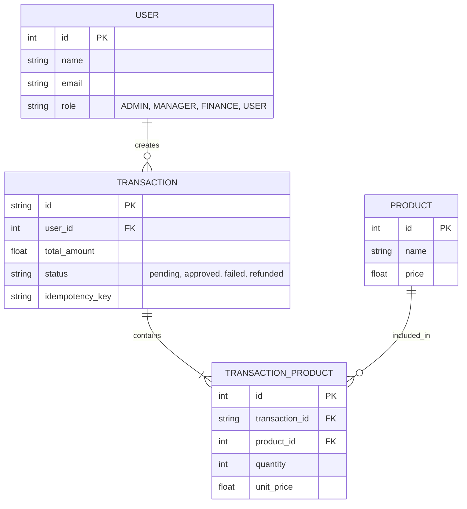
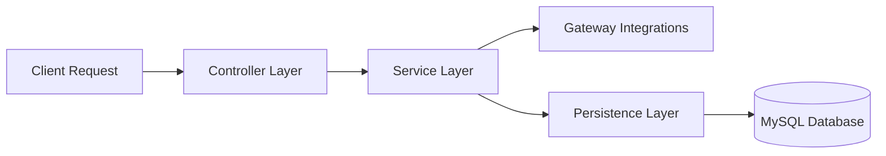
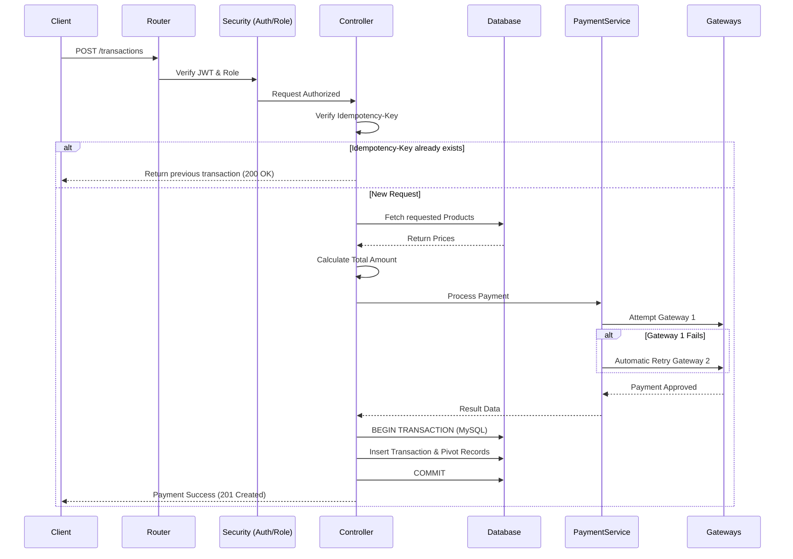

# 🏛️ System Architecture Details

This document provides an in-depth view of the architectural decisions, system layers, and data relationships of the BeTalent Payment API.

---

## 1. Domain Model (Entity Relationship Diagram)

This diagram illustrates how the database tables interact. It highlights the one-to-many relationship between Transactions and Products, handled by the pivot table `transaction_products`.

---

## 2. Layered Architecture Mapping

The API uses a strict separation of concerns. HTTP transport logic never mixes with business rules or database queries.

| Architectural Layer | File / Component | Responsibility |
|---------------------|------------------|----------------|
| **Controller Layer** | `TransactionsController.ts` | Handles HTTP, extracts payload, returns JSON. |
| **Service Layer** | `PaymentService.ts` | Orchestrates payment logic and gateway failover. |
| **Gateway Layer** | External Mock APIs | Simulates credit card processing. |
| **Persistence Layer** | `Transaction.ts`, `Product.ts` | AdonisJS Lucid ORM Models. |
| **Security Layer** | `auth_middleware`, `role_middleware` | Validates JWT tokens and user permissions. |

---

## 3. Complete Payment Sequence

This diagram maps the exact execution order of the system when a user attempts to make a payment.

