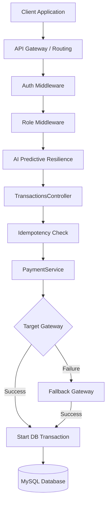
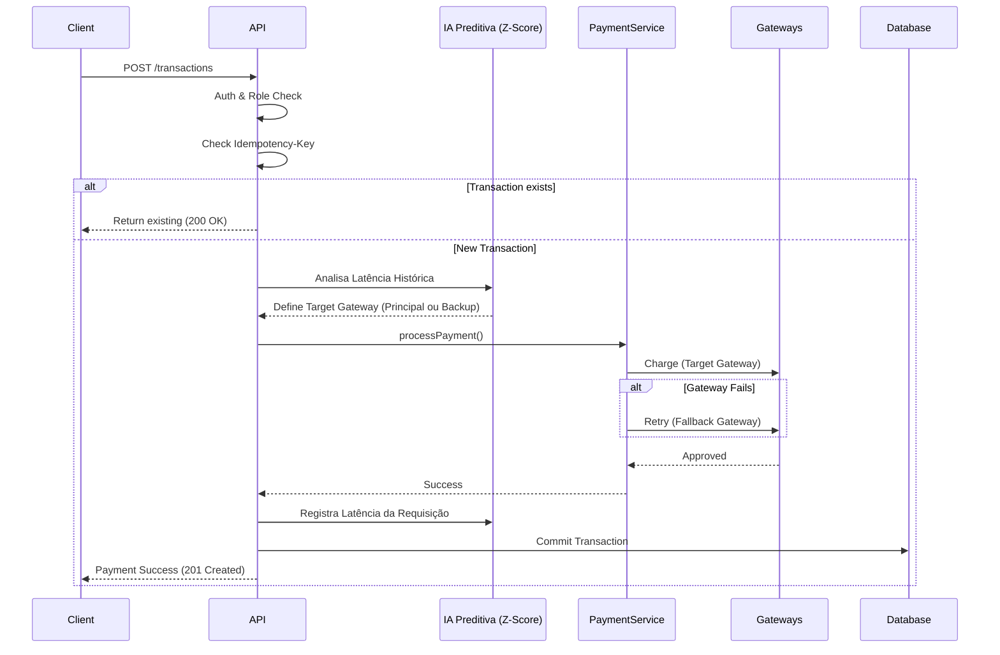

# BeTalent Payment API


RESTful API for payment processing with multi-gateway failover, role-based access control (RBAC), and chargeback management.

This project was developed as part of the **BeTalent technical challenge** and implements a complete checkout and payment processing workflow, including product pricing calculation, transaction persistence, gateway integration, and financial management capabilities.

---

## Challenge Scope

Target Level: **Level 3 (Advanced)**

All Level 3 requirements were implemented, including:

- Backend price calculation based on multiple products
- Strong typing using TypeScript
- Secure gateway authentication
- Role-based access control (ADMIN, MANAGER, FINANCE, USER)
- Chargeback processing and financial status management

The project focuses on demonstrating backend architecture, fault tolerance, and clear separation of responsibilities.

---

# System Architecture

## 🏗️ Architecture Overview

The system was designed with a clear separation of concerns, ensuring scalability and maintainability.

### Request Flow


### System Sequence Diagram


The application follows a modular architecture emphasizing maintainability, separation of concerns, and resilience.

Two architectural patterns guide the design:

- **Service Layer Pattern** for isolating business logic
- **Failover Strategy Pattern** for gateway redundancy

---

## Architectural Layers

### Controller Layer
Responsible for handling HTTP requests, validating input data, and formatting API responses.

### Service Layer
Contains the core business logic, including payment orchestration, gateway communication, transaction validation, and chargeback processing.

### Model Layer
Handles database persistence and entity relationships using the AdonisJS Lucid ORM.

---

# Payment Processing Strategy

The central payment logic is implemented in the `PaymentService`, which orchestrates communication between the API and external payment gateways.

To improve availability and reliability, the system implements a **Gateway Failover Strategy**.

If the primary gateway fails due to network errors, timeout, or provider refusal, the system automatically retries the transaction using a secondary gateway.

This retry process occurs transparently to the client application.

---

## Payment Flow

```text
Client Application
       │
       ▼
AdonisJS API (TransactionsController)
       │
       ├─► [AI Middleware: Analyzes Latency]
       │
       ▼
PaymentService (Failover Engine)
       │
       ├──► Target Gateway ── (Success) ──┐
       │                                  │
   (Failure)                              ▼
       │                     Transaction Persistence (MySQL)
       └──► Fallback Gateway ─────────────┘
```

### 🧠 Resilience, AI & Data Integrity

To ensure enterprise-grade reliability, the payment flow also implements:

- **Predictive Resilience (AI & Z-Score):** A custom middleware acts as a sentry, analyzing gateway response times in real-time. Using Z-Score statistical calculation, the system detects latency anomalies and automatically routes transactions to a contingency gateway *before* a timeout cascade occurs.
- **Idempotency:** The API requires an `Idempotency-Key` header for checkout requests. This prevents duplicate charges in case of network retries or accidental double-clicks by the user.
- **ACID Transactions:** All database operations (e.g., creating the main transaction and linking purchased products) are wrapped in Database Transactions. If any step fails, the entire operation is rolled back, preventing orphaned data or inconsistent financial states.

---

# Role-Based Access Control

The system implements RBAC to control access to financial operations.

| Role | Permissions |
|-----|-------------|
| ADMIN | Full system access |
| MANAGER | Operational management |
| FINANCE | Financial operations and chargebacks |
| USER | Checkout and payment requests |

---

# Technology Stack

Backend technologies used in this project:

- Node.js
- TypeScript
- AdonisJS
- MySQL
- Docker

---

# Project Structure

Example of the main project structure:

```text
app/
 ├── Controllers/
 ├── Services/
 ├── Models/
 ├── Middleware/

database/
 ├── migrations
 ├── seeders

start/
 ├── routes.ts
```

The architecture separates business logic from HTTP concerns and persistence, improving maintainability and testability.

---

# Running the Project

Clone the repository:

```bash
git clone [https://github.com/your-user/betalent-payment-api.git](https://github.com/your-user/betalent-payment-api.git)
```

Navigate to the project directory:

```bash
cd betalent-payment-api
```

Install dependencies:

```bash
npm install
```

Run database migrations:

```bash
node ace migration:run
```

Start the development server:

```bash
npm run dev
```

If Docker is configured, the environment can also be started with:

```bash
docker compose up
```

---

# Example API Request

Create a payment transaction:

```http
POST /transactions
```

Example payload:

```json
{
  "user_id": 1,
  "products": [
    {
      "product_id": 10,
      "quantity": 2
    }
  ],
  "payment_method": "credit_card"
}
```

Example response:

```json
{
  "transaction_id": "txn_12345",
  "status": "approved",
  "gateway": "primary_gateway",
  "amount": 200.00
}
```

---

# Possible Production Improvements

Although the challenge requirements were fully implemented, a production-grade payment system could include additional resilience and scalability mechanisms such as:

- Circuit breaker to prevent repeated calls to failing gateways
- Rate limiting to protect the API against abuse
- Asynchronous payment processing using message queues
- Observability through structured logging and metrics
- Distributed tracing for external gateway calls

These improvements would further enhance reliability and scalability in high-traffic environments.

---

# License

This project was developed for the BeTalent technical challenge and is intended for evaluation and educational purposes.